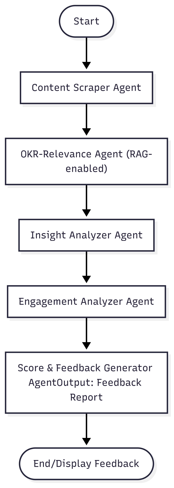

# Final Hackathon Project

This repository contains the code and resources for the Final Hackathon project. It consists of two main folders:

- `agent_backend`: Backend services and agents implementation.
- `agentic_ai_hackathon`: Frontend application and UI components.

---

## Folder Structure

### agent_backend

```
.gitignore
main.py
requirements.txt
agent/
├── __init__.py
├── depth_originality_agent.py
├── extract_content.py
├── feedback_agent.py
├── relevance_rag_agent.py
└── social_impact_agent.py
chroma_okr/
├── chroma.sqlite3
└── 3bb09a40-2552-4e0c-81cc-75d10727961e/
    ├── data_level0.bin
    ├── header.bin
    ├── length.bin
    └── link_lists.bin
Data/
└── okr_reference.txt
db/
└── mongo.py
utils/
└── extract_score.py
```

### agentic_ai_hackathon

```
.gitignore
.prettierrc
components.json
eslint.config.js
index.html
jsconfig.json
package-lock.json
package.json
vite.config.js
public/
└── vite.svg
src/
├── App.css
├── App.jsx
├── index.css
├── main.jsx
├── api/
│   └── axiosInstance.js
├── app/
│   ├── store.js
│   └── features/
│       └── login/
│           └── loginReducer.js
├── assets/
│   └── react.svg
├── components/
│   ├── custom_components/
│   │   ├── app-sidebar.jsx
│   │   ├── EvaluationFeedback.jsx
│   │   ├── feedback_display.jsx
│   │   ├── layout.jsx
│   │   ├── login-form.jsx
│   │   ├── nav-main.jsx
│   │   ├── nav-projects.jsx
│   │   ├── nav-user.jsx
│   │   ├── team-switcher.jsx
│   │   └── UserLayout.jsx
│   └── ui/
│       ├── avatar.jsx
│       ├── breadcrumb.jsx
│       ├── button.jsx
│       ├── collapsible.jsx
│       ├── dropdown-menu.jsx
│       ├── form.jsx
│       ├── input.jsx
│       ├── label.jsx
│       ├── separator.jsx
│       ├── sheet.jsx
│       ├── sidebar.jsx
│       ├── skeleton.jsx
│       ├── sonner.jsx
│       └── tooltip.jsx
├── hooks/
│   └── use-mobile.js
├── lib/
│   └── utils.js
├── pages/
│   ├── Home.jsx
│   ├── TaskSubmission.jsx
│   └── auth/
│       └── Login.jsx
└── routes/
    └── index.jsx
```

---

## Workflow Diagram



---

## Demo Video

Watch the demo video showcasing the project workflow and features:

[Demo Video Link](https://drive.google.com/file/d/1QrRtnLiz83Zezc_0BQNpIgFmgomyYQuv/view?usp=sharing)

---

This README provides an overview of the project structure and resources to help you navigate and understand the Final Hackathon project.
